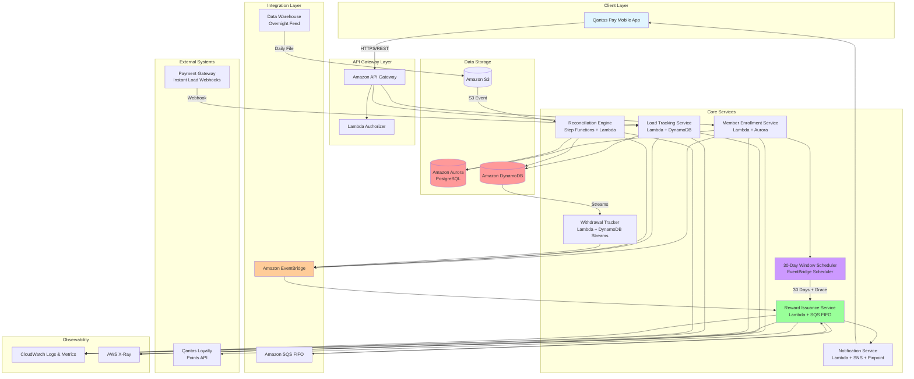
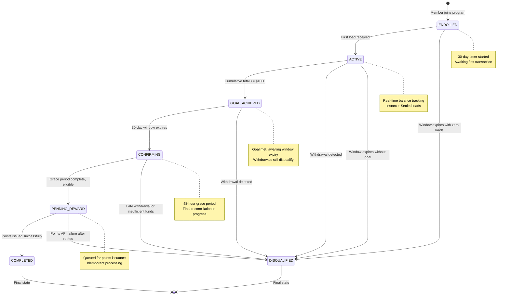
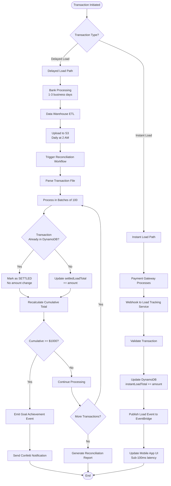
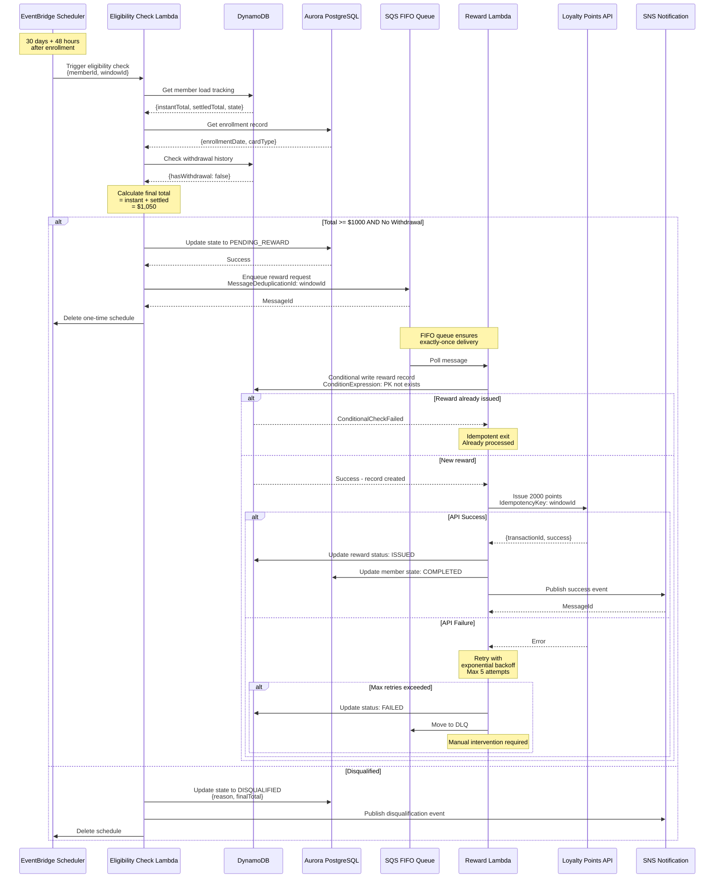
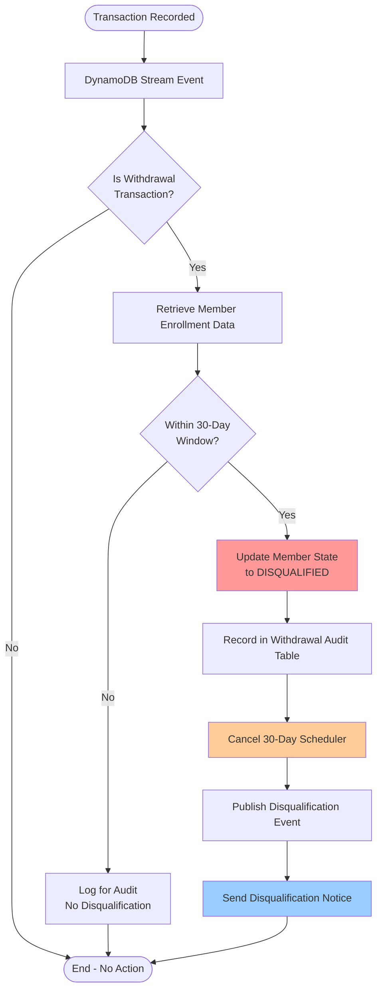
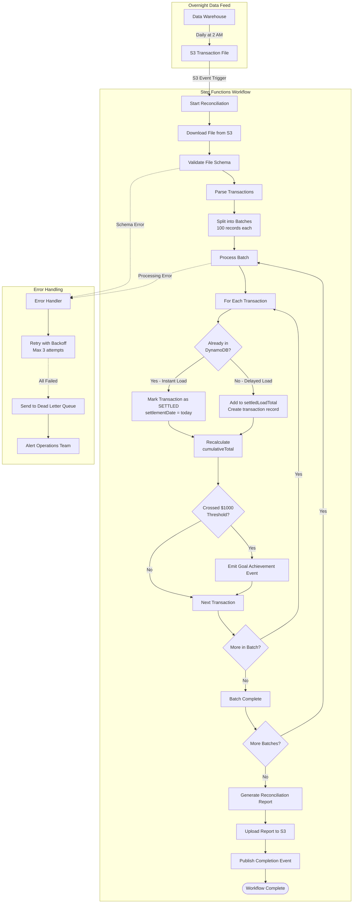
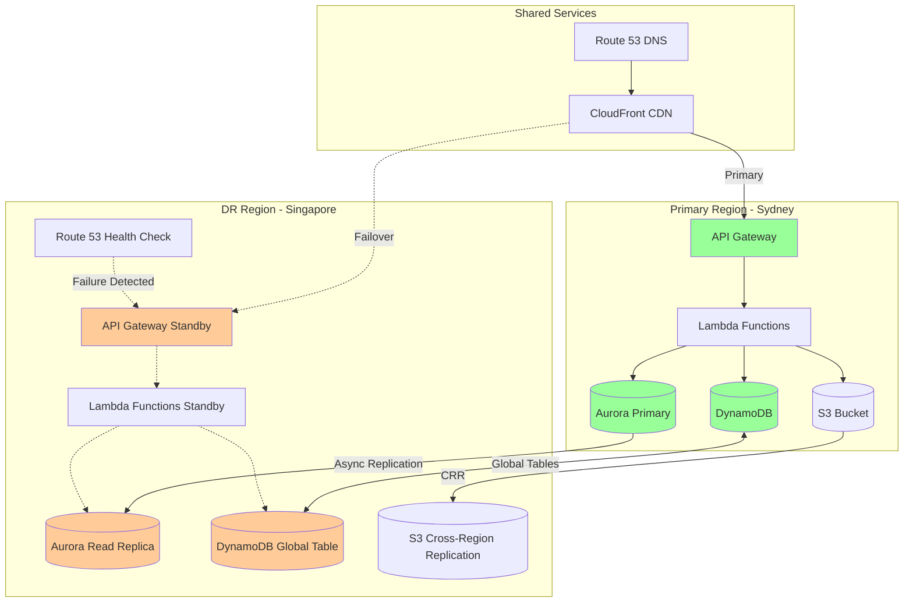

# System Architecture Diagrams

## 1. High-Level System Architecture

## 2. Member Lifecycle State Machine

## 3. Data Reconciliation Flow

## 4. Reward Issuance Sequence

## 5. Real-Time Load Processing

```mermaid
flowchart LR
    subgraph "Payment Gateway"
        Card[Debit Card /<br/>Apple Pay /<br/>Google Pay]
    end
    
    subgraph "Load Tracking Service"
        Webhook[Webhook Handler]
        Validator[Transaction Validator]
        Processor[Load Processor]
    end
    
    subgraph "DynamoDB"
        LoadTable[(Member Load Tracking)]
        TxnTable[(Transaction History)]
    end
    
    subgraph "Event Processing"
        EventBridge[EventBridge]
        Withdrawal[Withdrawal Tracker]
        Notification[Notification Service]
    end
    
    subgraph "Mobile App"
        UI[Real-time Balance UI]
    end
    
    Card -->|Instant Transaction| Webhook
    Webhook -->|Validate Signature| Validator
    Validator -->|Parse Event| Processor
    
    Processor -->|Optimistic Lock Update| LoadTable
    Processor -->|Insert Transaction| TxnTable
    
    LoadTable -.->|Read Committed| Processor
    Processor -->|Publish Load Event| EventBridge
    
    EventBridge -->|Route by Type| Withdrawal
    EventBridge -->|Route by Type| Notification
    
    Notification -->|Push/SMS| UI
    LoadTable -.->|Query Balance| UI
    
    TxnTable -->|DynamoDB Streams| Withdrawal
    Withdrawal -->|Check Withdrawal| EventBridge
```

## 6. Withdrawal Detection Flow

## 7. Reconciliation Engine Workflow

## 8. Multi-Region Disaster Recovery

---

## Diagram Legend

- **Blue boxes**: Client-facing components
- **Green boxes**: Active/Primary components
- **Orange boxes**: Standby/Secondary components
- **Red cylinders**: Data storage
- **Purple boxes**: Event processing
- **Solid arrows**: Active data flow
- **Dashed arrows**: Backup/Failover paths